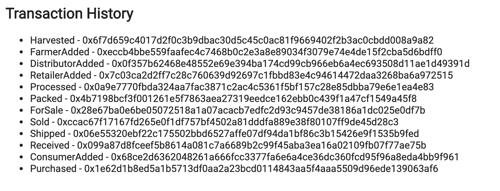

# CoffeeChain: A Fair Trade Coffee Supply Chain Dapp

[](https://travis-ci.org/jensendarren/Coffee-Supply-Chain-Dapp)

## A Fair Trade Coffee Supply Chain Dapp (CoffeeChain). Written using Solidity, web3.js and the Truffle Webpack Box

This application is the third Project for the [Blockchain Nanodegree](https://www.udacity.com/course/blockchain-developer-nanodegree--nd1309) with __Udacity__. Enjoy and feel free to comment!

## Library versions used in the project.

This project was built using the following framework versions:

* Truffle v5.1.14-nodeLTS.0 (core: 5.1.13)
* Solidity v0.5.16 (solc-js)
* Node v12.14.1
* Web3.js v1.2.1
* Truffle Assertions v0.9.2

## IPFS Details

IPFS was not used in this project.

## Supply Chain Contract Address on the Rinkeby Network

The Supply Chain Contract Address on Rinkeby Network is: **0xB4a0131Bd169BAf980E39EcdaB9B77C23E1D2a5E** and can be viewed on the Rinkeby Etherscan website [here](https://rinkeby.etherscan.io/address/0xB4a0131Bd169BAf980E39EcdaB9B77C23E1D2a5E)

The Supply Chain Contract Transaction Hash on Rinkeby Network is: **0x2898bb06f4cdec1218d3d2e2f802213f52d669469bef05c5a69b9163534ff34f** and can be viewed on the Rinkeby Etherscan website  [here](https://rinkeby.etherscan.io/tx/0x2898bb06f4cdec1218d3d2e2f802213f52d669469bef05c5a69b9163534ff34f)

## UML Diagrams

NOTE: The _Regulator_ role has not been included in the final solution and that some method names used in the diagrams may be slightly different in the code.

### Activity Diagram


### Sequence Diagram


### State Diagram


### Class Diagram


## Run the application

In order to run the application locally you will need to do the following:

```
touch .secret
npm install
ganache-cli -m "spirit supply whale amount human item harsh scare congress discover talent hamster"
npm run dev
```

## Client side app

In order to test the client side application, its necessary to import the different actor roles into your MetaMask and to ensure that each actor role is added to the deployed contract.

### Step 1: Import all actor accounts into your MetaMask

Keep the first account (index 0) as the contract owner and make account 1 - 4 as the actors as follows:

* 0x018C2daBef4904ECbd7118350A0c54DbeaE3549A - **Farmer Account**
* 0xCe5144391B4aB80668965F2Cc4f2CC102380Ef0A - **Distributor Account**
* 0x460c31107DD048e34971E57DA2F99f659Add4f02 - **Retailer Account**
* 0xD37b7B8C62BE2fdDe8dAa9816483AeBDBd356088 - **Consumer Account**

Use the private keys for each of these accounts to add to MetaMask. Optionally rename the accounts to help with testing as shown below:


### Step 2: Associate each actor account to the deployed supply chain contract

In your local `truffle console` terminal window run the following code to associate each actor account to the deployed supply chain contract:

```js
originFarmerID = accounts[1]
distributorID = accounts[2]
retailerID = accounts[3]
consumerID = accounts[4]
let supplyChain = await SupplyChain.deployed()
await supplyChain.addFarmer(originFarmerID)
await supplyChain.addDistributor(distributorID)
await supplyChain.addRetailer(retailerID)
await supplyChain.addConsumer(consumerID)
```

### Step 3: Test the client app in your local browser + MetaMask

Now open the app and in MetaMask select the Farmer account. Now interact with the app, performing the transactions that a Farmer is allowed to perform. Notice that if you try to perform a transaction that a Farmer _cannot_ process there is a transaction error and the approriate message is shown in the log. In oder to process the entire flow of the supply chain you will need to switch wallet addresses to the different actor wallets that were imported in Step 1 above to complete the end to end journey through the entire supply chain.

Note that the transaction history contains the events logged for adding the actors to the contract as well as any transactions you have just performed as shown below:



### Issue Reporting

If you experience with bugs or need further improvement, please create a new issue under [Issues](https://github.com/jensendarren/Coffee-Supply-Chain-Dapp/issues).

### Contributing to this application.

Pull requests are very welcome. Before submitting a pull request, please make sure that your changes are well tested. Pull requests without tests will not be accepted.

### Development

You will need to launch ganache as follows:

```
ganache-cli -m "spirit supply whale amount human item harsh scare congress discover talent hamster"
```

You can then run tests as follows:

```
truffle test
```

### Authors

This **CoffeeChain Ethereum Dapp** application was developed as part of the Blockchain Nanodegree with [Udacity](http://www.udacity.com) and [Darren Jensen](http://www.tweetegy.com).

### License

This **CoffeeChain Ethereum Dapp** application is released under [AGPL](http://www.gnu.org/licenses/agpl-3.0-standalone.html)

### Disclaimer

This application is part of a _project assignment_ and is most definitely __not__ suitable for Production use! :)